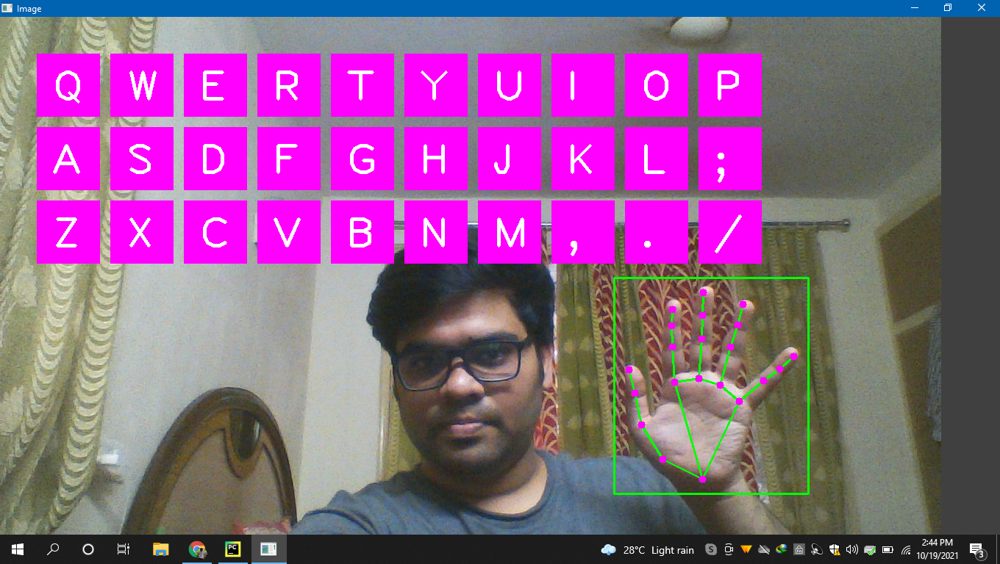

# AI-Keyboard

## Introduction :

  - This is a AI virtual keyboard built using OpenCV.
  - The idea behind this project is to have hands on over computer vision and its terminology.
 
## Packages used : 

  - import cv2
  - from cvzone.HandTrackingModule import HandDetector
  - from time import sleep
  - from pynput.keyboard import Controller
  - import cvzone
  - import numpy as np

## Working Images : 

  

## Installation Process and Working
- Include all the files present in the repository.
- Install all the requirements listed in requirements.txt file
- run main.py
- Open notepad or any editor on the screen
- 

## Future Work :
- Will be working on the precision and accuracy of character selection.
- Will work on the ideas to bring "ENTER Key" , "Space Key" , "Backspace Key" and many more buttons.

